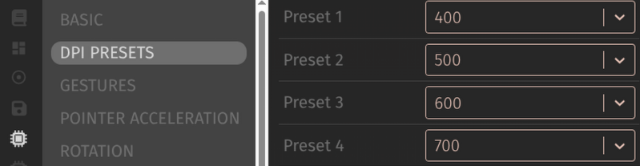

# Plodah's Via Menus for Ploopy

This firmware adds several features to Ploopy trackballs and mice.
These features can then be tweaked from menus in Via.

This repo is essentially a [qmk_userspace](https://docs.qmk.fm/newbs_external_userspace) containing supplementary keymaps and user-level features for [qmk_firmware](https://github.com/qmk/qmk_firmware).

If you're looking for more information on anything here, you may be able to find it within the docs for [QMK](https://docs.qmk.fm/), and [Via](https://caniusvia.com/). 

## Please Note
**Testing has limitations!**
I use this firmware, on my Adept or Thumb daily but I am just one guy. As much as I would like to, I don't have every device, so am completely relying on user feedback if I don't have the hardware.

Naturally, there are problems in the firwmare that I haven't noticed. I've fixed many, but fully expect there to be more found. If you do notice anything, let me know with a discussion post here. I can often be reached on the Ploopy Discord.

## What does it do? 

First and foremost, I made this firmware so that I could adjust the DPI and dragscroll settings to whatever I wanted without re-compiling firmware.

From there, I just kept adding stuff. Some of it is genuinely useful and some of it completely stupid (but fun). 
- **Drag Actions** - Can turn the trackball into a volume control while held
- **Mouse Jiggler** - No software solution to stopping a computer from going to sleep.
- **Rotation** - If you want to use an Adept at an angle, change the pointer rotation to compensate.
- *See the [Feature list](readme-resources/FEATURES.md) for a more comprehensive list*

 ### What's new (Feb 2026)
- Add support for Ploopy Nano 2
- Pointer rotation compensate for device orientation (on PMW3360 devices)
- Pointer Acceleration - As per [Drashna's module](https://github.com/drashna/qmk_modules/tree/main/pointing_device_accel)
- Change scroll wheel action (for devices that have them)
- Drag-Action replaces Drag-volume.. It does Volume by default but can be changed to any keyboard key
- DPI controls can be a slider instead of a drop-down list.
- Turbo fire - Repeatedly send a click or keyboard key.
- Morse Code typing - Yes, this is stupid (but fun)
- Task-switcher customization - Fully customizeable but basically just to allow Cmd
+Tab instead of Alt+Tab for Mac users
- Feature flags - Check what features are available when deciding what menus to show.

### Known Problems
#### No major issues overall
Things pretty much work as intended, as far as I am aware.
Most of the messages I receive are asking about more features!

#### No room for more
Devices which have ATMEGA chips are very limited in space. They chips have only 28KB, which is tiny in comparison to the RP2040 which are found in pretty much all of the current Ploopy lineup.

Therefore, some features will be excluded from the more limited devices.
I might release multiple versions with different features per device.. Not sure how to approach it.

Affected devices are:
- Classic (not classic 2*)
- Mini 
- Mouse (before Jan 2025* refresh)
- Nano 1 (but not Nano 2)
- Thumb (before Jan 2025* refresh)

*source: Ploopy's [Our plans for 2025](https://blog.ploopy.co/our-plans-for-2025-158) blog post*

#### Tapdances
Via only supports the "keyboard" level custom keycodes. Those that are set up in a module, or at the user level can't be added to the custom menu
I've created "proxy" keycodes at the keyboard level for most, but haven't found a similar workaround for tapdance next.
These will appear as their hex keycode in Via and can only be assigned with the same;

| Key | Code | Notes |
| --- | --- | --- | 
| Dragscroll Tapdance | `0x5700` | Momentary dragscroll, toggles when tapped twice |

## What doesn't it do?
### Stuff that I think is possible, and may implement later
| Feature Name | Status | Notes | 
| --- | --- | --- |
| Turbo Fire | **Done** Feb 2026  | repeatedly send a click or keyboard key |
| Mouse Jiggler Menus | | Control of pattern & rate with menus |
| Pointer Rotation | **DONE** Feb 2026 | *for pmw devices only* - others don't seem possible |
| Pointer accelaration | **DONE** Feb 2026 | add [Drashna's module](https://github.com/drashna/qmk_modules/tree/main/pointing_device_accel) and menus |
| High Resolution Scrolling | | See [this blog post](https://blog.ploopy.co/high-resolution-scrolling-for-the-adept-257) on the subject. When implemented, would of course have to include menus. |
| Trackpad Support | | Obviously a different animal, but I think I could find some features to add and customize with menus |
| Do some Knob Stuff | | I'd like to change the knob function while (e.g.) Caps lock is on (useful & achievable).. and I kinda want to see if I could make use it as a numpad, like a rotary phone. |

### Stuff I would like to achieve, but have no earthly idea how to do so
- invoke custom actions by moving the pointer in a circle, figure 8.
- Customizeable tapdances within Via
- World peace

## How do I use it?

Before following these instructions I would ask you make sure you're comfortable with what you're doing. It's very difficult to permanently brick a device, but it can be very frustrating to trouble shoot when you're not famililar.

It's also worth reviewing the instructions at the bottom of the page which let you know how to return your device to (something like) the original firmware as a plan B.

### Download and flash the firmware

1. Download Firmware and JSON from [**Releases**](https://github.com/plodah/ploopy_viamenus/releases)
      
   I do not recommend using the `latest` release- it may have new stuff but is 10x more likely to be borked and lacks documentation.
2. Flash the firmware

   For most new ploopy devices (those with RP2040 chips), you hold some button while plugging in the device then copy a uf2 file to a storage drive. 
   
   Otherwise, use QMK toolbox. [Here is QMK's guide](https://docs.qmk.fm/newbs_flashing).
3. Import the json file to Via's 🖌️ design tab. If you don't have 🖌️ at the top of the Via, enable design tab it in settings ⚙️
    
    Alternatively, use my version of Via at [via.plodah.uk](https://via.plodah.uk), which allows you to skip importing the json.
4. When updating to a new release, please update both firmware and Via JSON.

## I regret everything, take me back
If it all gets too much and you yearn for a simpler time, and wish to return your device to the original firmware or just something simpler.

1. Download the original firmware. Good sources are:-
    - [Via](https://www.caniusevia.com/docs/download_firmware) - pretty much the original firmware.
    - [QMK](https://github.com/qmk/qmk_firmware) - build from the github source or use tools like [build.qmk.fm](https://build.qmk.fm) or [config.qmk.fm](https://config.qmk.fm) 
    - [Ploopy's Github](https://github.com/ploopyco) - there's a repo per device and firmware location varies
    - [keyboard.gay](https://keyboard.gay/)🏳️‍🌈 basic firmware with for Vial firmware
2. Flash the firmware; e.g. with QMK toolbox. [Here is QMK's guide](https://docs.qmk.fm/newbs_flashing)
   - _In the releases before 2025-03-29, be aware that the "bootmagic" key may be different to original firmware_
     - _e.g. Thumb: little button (originally scroll wheel) Adept: top left (originally bottom left)_
3. Remove the imported json from Via or clear site data from your browser.
4. If you were encountering a bug that made it impossible to use your trackball, let me know so I might be able to help fix it.

Thanks for reading,
Plodah
