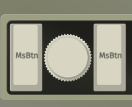
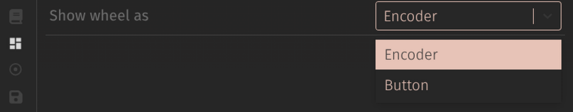

# Features

## DPI Config
Configure 5 **DPI** presets and switch between them.

Drop-down menus are the default DPI selectors, but using sliders allows a much greater range of options.

To use this, find the `Experience` Menu, and change the `Show DPI as` option to `Slider`.

Individual DPI presets will then appear as below- this example shows 4300 dpi

I also would recommend changing Via's settings to show a numerical value by the slider, as I've done above.

## Dragscroll
Expanded version of dragscroll. 
This can be activated in several ways
- Momentary or Toggle keys
- When a specific layer is active
- When caps/num/scroll lock are on
- a Tapdance, which will act as a momentary dragscroll, but when tapped twice will toggle

As well as several other additions
- Adjust the dragscroll divisor to control scroll speed relative to DPI
- invert dragscroll direction for x/y independently
- Optionally stop dragscroll when another key is pressed
- Dragscroll Straightening; ignore slight side-scrolling while scrolling up/down (and vice-versa).
  The sensitivity can be adjusted; 75% sensitivity will ignore side scroll if it's <75% of the greater scroll. 100% sensitivity is fully one-dimensional.

## Drag-~~volume~~ actions
Hold down this key, and move the ball. 
While this key is held, pointer movement is stopped and up/down/left/right movement performs some action of your choice. 
This was originally just Volume, but expanded to allow whatever actions, even if that's just reversing the volume direction.
What could you use this for? I guess Volume+/-, arrow keys, wasd.

## Mouse Jiggler 
The pointer will move an imperceptably small amount, in a pseudo-random direction at a pseudo-random interval.
This should be enough to keep your computer awake when you're not using it, but since it's only 1-2 px at a time, it's small enough that it doesn't hinder normal mouse usage.
_I am not liable for any disciplinary action taken by your employer!_
The jiggler will draw a circle to confirm it has been enabled, and a horizontal line to show when it's turned off.
Can be switched on/off by key press, via menu or gesture.

## Sniper mode
Change DPI while the appropriate button is held
Called this "sniper" mode since it's useful for fine movement, but could just as easily increase DPI if preferred.

## Gestures
Similar to _"Wiggleball"_ 
Wiggle the cursor to enable dragscroll or mouse jiggler (or not, if you prefer)

## Task Switcher
Keys allow you to "alt tab" between open Windows. 
Alt is held for ~1 second after this key released to allow switching between several windows.

This can be customized from menus to alter what keys are sent, and how long they are held for... This of course allows you to use it on Mac by changing it to Cmd+Tab

## Rotate pointer movement  **new for Feb 2026**
If you want to use the device sideways, reconfigure the sensor to compensate. 
Can move 90 degrees clockwise/counter-clockwise. Use this in combination with "invert x/y" to allow any orientation through 360 degrees.

## Pointer Acceleration  **added Feb 2026**
This is just As per [Drashna's module](https://github.com/drashna/qmk_modules/tree/main/pointing_device_accel). Changes the relationship between mousing input and pointer movement for precise selection at slow-speeds but also allowing you to whip the cursor the width 3 displays.

## Scroll Wheels 

The scroll wheel shows like a knob would in Via. This allows you to customize what the scroll wheel does.. maybe use it as Volume in a secondary layer.

Don't like it that way? show it as a button from the "layouts" menu.

## Turbo Fire
Repeatedly send a click or keyboard key.
Menus allow the key that's sent to be customized, as well as the interval between clicks and how long one click lasts.

I hope you like Cookies.

I just right now while writing this decided I need to make a super slow version to tap F5 every 30 seconds.. Yeah you could do that with a browser extension but my work computer blocks 'em.

## Morse Code
*Plodah was so preoccupied with whether they could, they didn't stop to think if they should.*

It does what it says on the tin- the "manual" keycode is what you'd expect- A short press is a Dit and a long press is a Dash.

There are also separate keys for each if that's your preferred way

## Feature Flags
This is not a "feature" to your average user, but is will be really helpful in future.

The firmware is *self-aware*, by which I mean that it knows which features it has, and reports this to Via. This allows Via to hide menus for missing features.

This might not sound like much, but it makes it means I can just copy paste the same menus between devices without worrying which features are actually needed. It also makes it easier for "x_super69noob_x_420_x". They don't care about `pointer rotation`, so they can remove that but  they really want 4 different `Turbo Fire` keys.
They can fairly easily change a couple of #define lines, then build and flash the firmware. 
When they open Via, it already knows. It hides the rotation options and shows Turbo Fire keys.
Niche but neat :)

## Custom Keycodes
| Key | Description |
| --- | --- |
| DPI Config | Stock Ploopy key to cycle between DPI presets |
| Ploopy Drag Scroll | Stock Ploopy key to turn on the original dragscroll.. it does **not** play nice with the "better" dragscroll keys |
| Better Drag Scroll Momentary/Toggle | Turn drag scroll on while held, or toggle on/off |
| Taskswitch Next/Prev | i.e. Alt + Tab or Alt + Shift + Tab includes a brief delay for useability |
| Sniper Momentary/Togle | additional DPI switching options. |
| Drag Actions | Stop cursor movememnt and send some key instead, e.g. Volume |
| Sensor Rotation | 15 degrees in either direction or reset |
| Turbo Clicker | Momentary or Toggle keys to control Turbo fire |
| Morse Code | Type in morse code |
